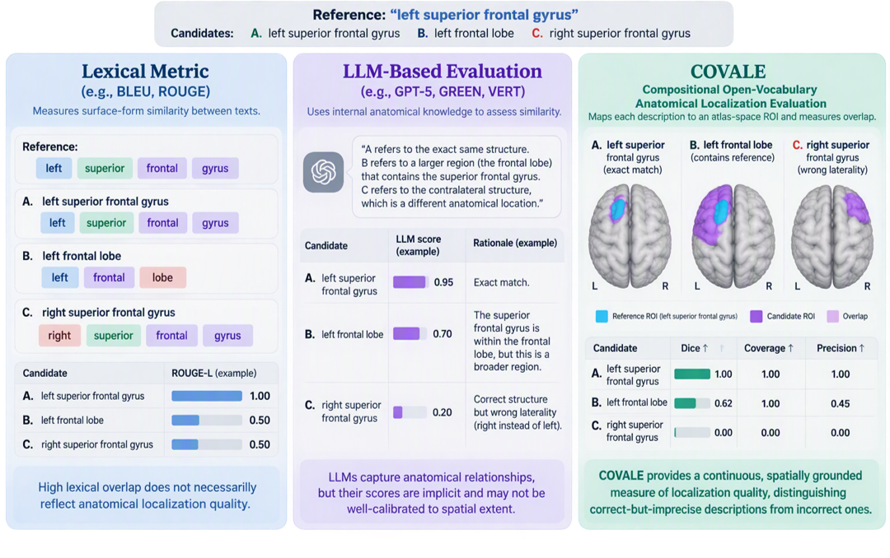

# COVALE: Compositional Open-Vocabulary Anatomical Localization Evaluation

Text-based metrics can tell whether two anatomical descriptions use similar
words, but they often miss whether the descriptions point to the same place.
COVALE turns each description into a 3D region in an anatomical atlas, then
measures how much the regions overlap. This makes it easy to compare generated
descriptions, evaluate systems, and provide spatial feedback during model
training.




## Quick start

```bash
pip install covale
```

```python
import os

from covale import COVALE

os.environ["OPENAI_API_KEY"] = "your-api-key"

score = COVALE().score(
    reference="left frontal lobe",
    candidate="left frontal region",
)
```

## Table of contents

- [Quick start](#quick-start)
- [Calculate COVALE](#calculate-covale)
- [Additional resources](#additional-resources)
- [License](#license)

## Calculate COVALE

Create an evaluator and pass equally sized lists of reference and candidate
descriptions:

```python
from covale import COVALE

covale_evaluator = COVALE(
    method="llm",
    model="gpt-6-astra",
    concurrency=4,
)
results = covale_evaluator(
    refs=[
        "left frontal lobe",
        "right temporal lobe",
    ],
    hyps=[
        "left frontal region",
        "right temporal region",
    ],
)
print(results["dice"])
```

Change `model` to select an OpenAI model. Increase `concurrency` to evaluate
independent pairs in parallel.

### Choose an evaluation method

Set `method` based on how descriptions should be compared:

| Method | Description | Uses atlas masks |
|---|---|---|
| `llm` (default) | Uses OpenAI to map each description to an atlas region, then calculates Dice overlap | Yes |
| `deep_agent` | Uses a Deep Agent to map each description to an atlas region, then calculates Dice overlap | Yes |
| `similarity` | Uses OpenAI to compare the descriptions directly as a language-only baseline | No |

### Evaluate reports

Add `extract_findings=True` when the inputs are sentences or reports rather
than isolated anatomical locations:

```python
report_evaluator = COVALE(
    extract_findings=True,
)
results = report_evaluator(
    refs=reference_reports,
    hyps=generated_reports,
)
```

COVALE extracts anatomically localized findings, aligns compatible findings
one to one, evaluates each matched location, and gives no credit for missing
or extra findings. Location strings remain the default and skip finding
extraction.

### Inspect detailed results

Add `output_mode="detailed"` to include per-sample scores, localization
expressions, timings, and categorized failures:

```python
detailed_evaluator = COVALE(
    output_mode="detailed",
)
results = detailed_evaluator(refs=refs, hyps=hyps)
```

## Additional resources

| Guide | Description |
|---|---|
| [Configuration](docs/configuration.md) | Reproducible YAML settings, output modes, and error handling |
| [Benchmarking](docs/benchmarking.md) | Annotating JSONL experiments with COVALE scores and runtime |
| [Comparing systems](docs/comparing-systems.md) | Statistical comparison of multiple systems against shared references |
| [Publishing](docs/publishing.md) | Building and publishing releases to PyPI with GitHub Actions |
| [RL rewards](docs/rl-rewards.md) | Creating and timing TRL-compatible reward functions |
| [Onboarding a new atlas](docs/atlas-onboarding.md) | Adding atlas metadata, labels, licensing, and a labeled NIfTI volume |

## License

COVALE is available under the [MIT License](LICENSE).